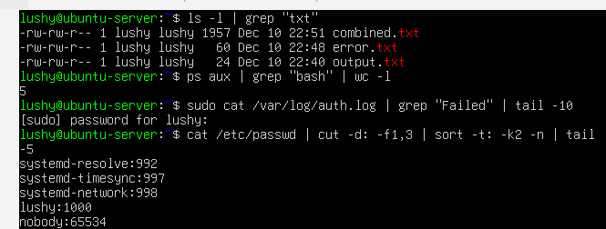

# Week 2 - Security Planning and Testing Methodology

## Overview
The activities completed in this lab were based on the week 5 lab and provied experience with using pipes,FIFOs and communication through files. This explores the communication mechanisms within the environment.

## Pipes and Redirection
Pipes and redirection allow processes to communicate by passing the ouptut of one command directly to the other, and reducing the need for intermediate files [4].

### Standard Output and Redirection
Standard output redirection was demonstrated using:

echo "Hello World" > output.txt
echo "Second line" >> output.txt
cat output.txt

It was tested using:
ls /nonexistent 2> error.txt

These techniques are used mainly for logging and error handling in Linux systems [8].

## Using Pipes
The screenshot below demonstrates the use of pipes and redirection. It shows how multiple processes can be linked together to analyse output in an effective way using pipes. Pipelines allow inter-processing communictation to run efficiently by passing output streams directly between commands [4], [9].

**Commands Used**
ls -l | grep "txt"
ps aux | grep "bash" | wc -l
sudo cat /var/log/auth.log | grep "Failed" | tail -10
cat /etc/passwd | cut -d: -f1,3 | sort -t: -k2 -n | tail

These commands used together shows:
-Commands output being filtered using grep
-Processes being counted using wc
-Analysing the logs and failed login attempts

## Evidence Screenshot

