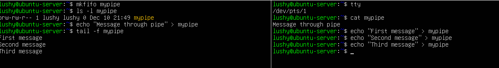
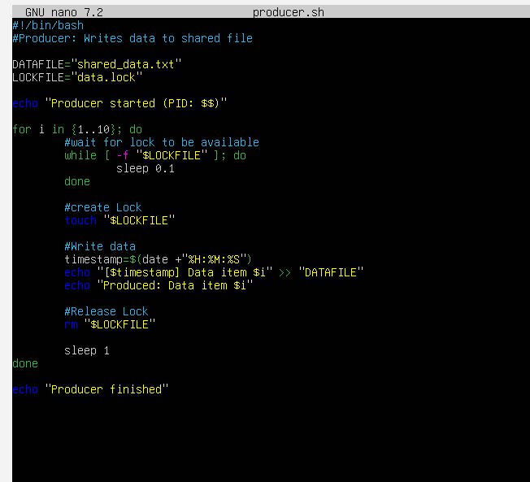
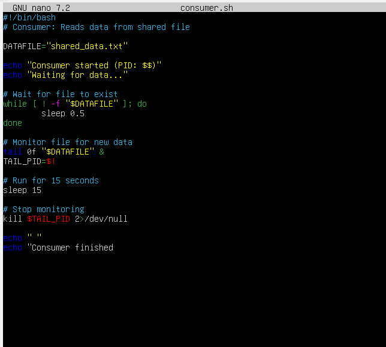
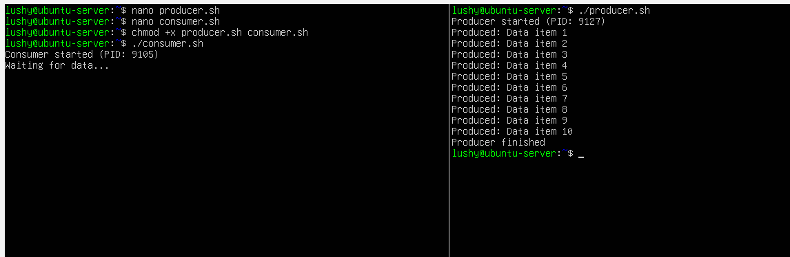

# Week 2 - Security Planning and Testing Methodology

## Overview
The activities completed in this lab were based on the week 5 lab and provied experience with using pipes,FIFOs and communication through files. This explores the communication mechanisms within the environment.

## Pipes and Redirection
Pipes and redirection allow processes to communicate by passing the ouptut of one command directly to the other, and reducing the need for intermediate files [3].

### Standard Output and Redirection
Standard output redirection was demonstrated using:

echo "Hello World" > output.txt
echo "Second line" >> output.txt
cat output.txt

It was tested using:
ls /nonexistent 2> error.txt

These techniques are used mainly for logging and error handling in Linux systems [6].

## Using Pipes
The screenshot below demonstrates the use of pipes and redirection. It shows how multiple processes can be linked together to analyse output in an effective way using pipes. Pipelines allow inter-processing communictation to run efficiently by passing output streams directly between commands [3], [6].

**Commands Used**
ls -l | grep "txt"
ps aux | grep "bash" | wc -l
sudo cat /var/log/auth.log | grep "Failed" | tail -10
cat /etc/passwd | cut -d: -f1,3 | sort -t: -k2 -n | tail

These commands used together shows:
-Commands output being filtered using grep
-Processes being counted using wc
-Analysing the logs and failed login attempts

## Evidence Screenshot

## Named Pipes 
Named pipes provide a mechanism that allows processes that are unrelated to communicate [3]. The screenshot below will show the creation and use of a named pipe to allow communication between two terminal sessions. One process writes the data into the FIFO while the other process reads from it in real-time, confirming real-time communication between unrelated processes [3], [4]

**Commands Used**
mkfifo mypipe
ls -l mypipe
echo "Message through pipe" > mypipe
cat mypipe

echo "First message" > mypipe
echo "Second message" > mypipe
echo "Third message" > mypipe
tail -f mypipe

## Evidence Screenshot

These outputs confirm that the messages written was successfully received by the reading process. 

## Difference Between Pipes and Named Pipes
-Anonymous pipes (|) are temporary and exist only durng the command execution

-Named pipes (FIFOs) persist as files and allows communication bewtween processes that are unrelated. They are useful for longer running or for communication with multiple terminals

## Process Signals
Signals were used to control and manage running processes. Signals such as SIGTERM and SIGKILL allow processes to terminate either gracefully or forcefully [5]. Signal handling is important for programs to ensure that resources are released correctly during termination [1].

## Signal Testing
Signals were explored using the following commands:
-kill -l: lists all available signals
-sleep 300 &: starts a background process
-kill PID: sends a SIGTERM
-kill -9 PID: forces termination using SIGKILL

Processes were also suspended and resumed using:
-Ctrl + Z
-bg
-fg

## File-Based Communication
File-based communication was shown using a producer and consumer script. It shows indirect communication through a shared storage and highlights the need for synchronisation [1].

## Producer Script 
The producer script wrote data to a shared file while using a lock file to prevent race conditions. The script uses a lock file to prevent race conditions:

#!/bin/bash
DATAFILE="shared_data.txt"
LOCKFILE="data.lock"

The use of lock file ensurs that only one process accesses the shred resource at a time, which prevents data corruption [4].

## Evidence Screenshot

## Consumer Script
The consumer script monitored the shared file using tail -f. This approach allows continous reading of new data as it becomes available.

## Evidence Screenshot

## Output
The producer and consumer scripts were executed and they demonstrated coordinated communication through the shared file. Output confirms that data items produced by the producer was successfully read by the consumer.

## Evidence Screenshot

## Reflection
Implementing these IPC mechanisms in this week highlighted the importance of coordination, locking and signal handling to prevent race conditions and ensure that the data exchange is reliable. These concepts are fundamental to programming and an operating system design that is secure. 

## References
[1] M. Kerrisk, The Linux Programming Interface. San Francisco, CA, USA: No Starch Press, 2010.
[2] The Linux Documentation Project, "Pipes and FIFOs", 2023 [Online]. Available: https://tldp.org/LDP/lpg/node11.html. [Accessed: Dec. 11, 2025].

