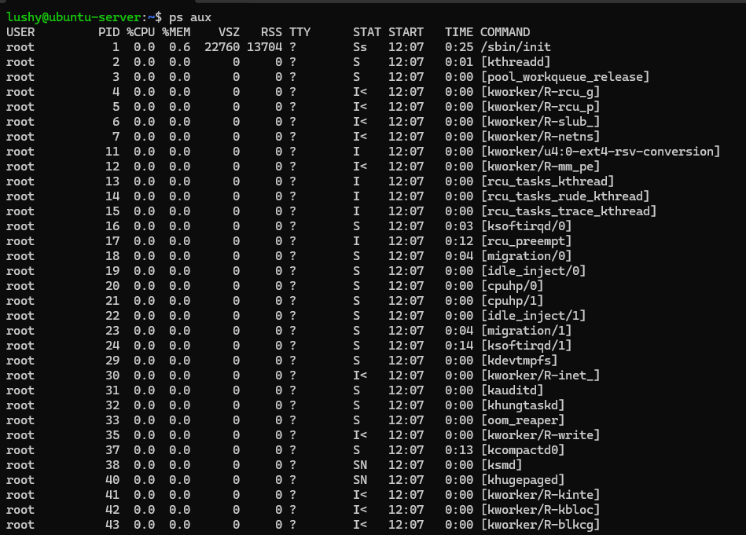
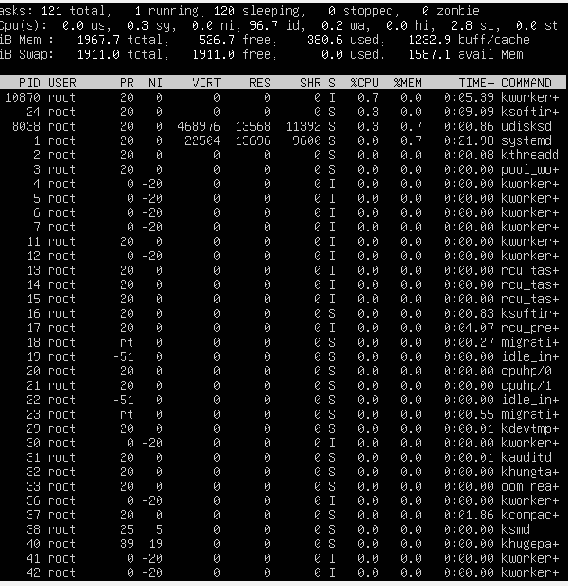
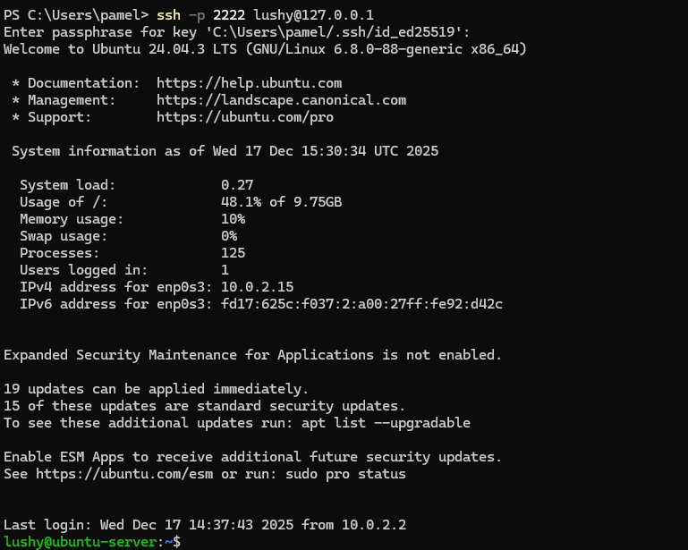
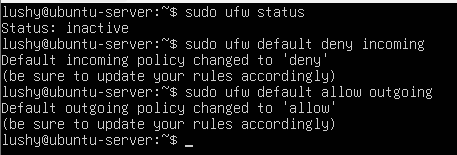
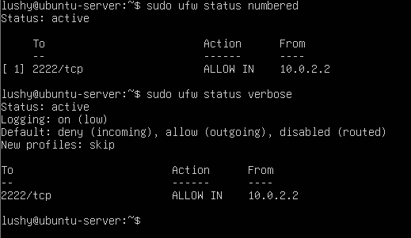
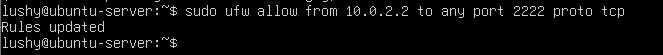
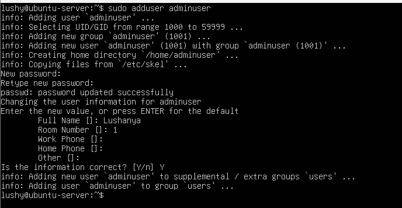
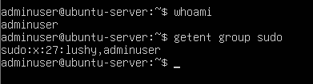
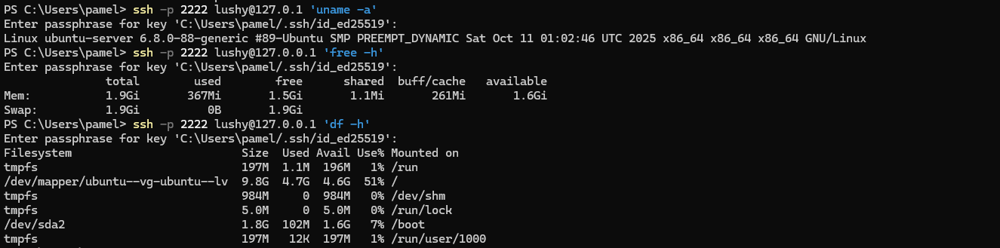
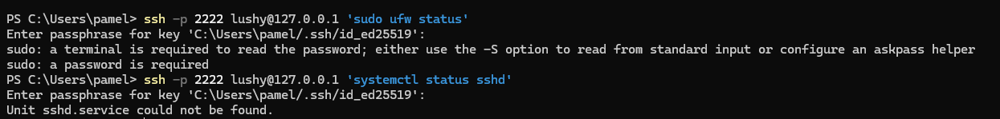

# Week 3 - Application Selection for Performance Testing

## Overview 
This week focuses on understanding the process management of Linux and implementing system security controls. In this week I was introduced to the exploration of process lifecycle and its states, fg and bg execution and signal handling. Remote administration was implemented through SSH key-based authentication and firewall configuration, which all contributes to secure server environment.
---

## Process Management

## Process States
**Commands used**
ps aux
ps -ef
top

**Running Processes (ps aux)**
The ps aux command displays a complete list of all running processes on the ubuntu server. This output includes system and user processes, showing their process IDs (PID), ownership, CPU usage etc. In my screenshot, the results confirm that core system services are running under the root user, while the user-level processes are isolated appropriately which supports the principle of least priviledge.

**Explanation of Key Columns**
-User: Owner of process
-PID: a unique Process ID
-%CPU: CPU usage
-%MEM: Memory usage
-STAT: Current process state
-COMMAND: the command that launched the process

**Common Process States**
-R: Running
-S: Sleeping
-D: Uninterruptible sleep (I/O)
-T: Stopped (Ctrl+Z)
-Zombie: terminated

## Evidence Screenshot

**Real-time process monitoring (top)**
top was used to observe the real time CPU and memory usage dynamically. This allowed identification of high-resource processes and sytem load trends. It provides a view that continuosly updates the running processes, CPU usage, memory consumption, process priority, runtime and the current state. In the screenshot below, it shows that most processes are owned by the root user which represents core system services. CPU utilisation is low, which indicates that the server is operating efficiently. Unlike ps aux, top is used to for live monitoring.

## Evidence Screenshot

##Process Hierarchy
**Commands Used**
pstree
pstree -p

## Bg and Fg Execution
**Commands Used**
sleep 300 &
jobs
sleep 500
bg
fg

## Process Termination
**Commands Used**
kill <PID>
killall sleep

## Process Priority
**Commands Used**
nice -n 10 sleep 400 &
top

## Explanation
-Foreground processes require user interaction
-Background processes allow multitasking
-kill sends SIGTERM gracefully
-kill -9 sends SIGKILL forcefully (unsafe if not used properly)
-nice adjusts scheduling priority to reduce CPU impact

**pstree**
This visualises the relationship between processes, and highlights how they are managed by the system.

## SSH Configuration
**SSH Key generation**
SSH keys were generated on the workstation using the Ed25519 method and the results were as shown below:

Ed25519 keys provide stronger security and better performance compared to older RSA keys, making them the recommended choice for modern systems.

**Copying the Key to the Server** 
The public key was copied using:
ssh-copy-id username@server_ip
This enables passwordless authentication, improving security by eliminating password-based login attacks. However, even though the system became passwordless, I was still prompted to enter my passphrase . This is because the passphrase protects the private SSH key and not the server.

## Evidence Screenshot

**SSH Configuration Hardening**
The SSH configuration was hardened by modyfing /etc/ssh/sshd_config and making these changes:
PasswordAuthentication no
PubkeyAuthentication yes
PermitRootLogin no

These changes prevent brute force password attacks, enforces key based authentication, and protects the root account from direct access.

## Firewall Configuration

**Commands used**
sudo ufw default deny incoming
sudo ufw default allow outgoing
sudo ufw allow from <workstation_ip> to any port 22
sudo ufw enable
sudo ufw status numbered

## Firewall Rules Table
Rule                      |Purpose                    |Security Benefit          |
---------------------------------------------------------------------------------|
Deny Incoming             |Block unsolicited traffic  |Prevents scanning         |
Allow Outgoing            |Enable updates             |System usability          |
Allow SSH from workstation|Restricted access          |Prevents lateral attacks  |

## Evidence Screenshots

## User Management
**User Creation**
sudo adduser adminuser
sudo usermod -aG sudo adminuser

## Evidence Screenshot

**Verifying User**
groups adminuser
id adminuser
getent group sudo

## Evidence Screenshot

**Principle of Least Priviledge**
Administrative tasks are performed using a non-root account, limiting damage from compromise.

## Remote Administration

## Evidence Screenshot

## Reflection
One challenge I faced was installing the SSH to my workstation and connecting it to my server. One of the reasons this did not work for me was ssh was disables on my device, so I then had to enable it. In this lab I learnt the importance of layered security, including SSH hardening, firewall restrictions and least priviledge user management.

