# Week 4 - Initial System Configuration & Security Implementation

## Overview
In this week we aimed to implement advanced security. It introduced MAC, intrusion detection etc. These collectively strengthened the sytem against priviledge misuse while monitoring the security.

## Mandatory Access Control (MAC)
Ubuntu Server uses AppArmor as its mandatory access control security base. It enforces security policies on applications by restricting the resources they are allowed to access.

The active MAC system was verfied using:

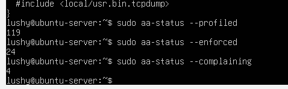

This command confirms that AppArmor was active.

Two operational modes were observed:
- **Enforce mode** - Policy violations are blocked and logged.
- **Complain mode** - Violations are logged but not blocked.

## AppArmor Status Reporting Script

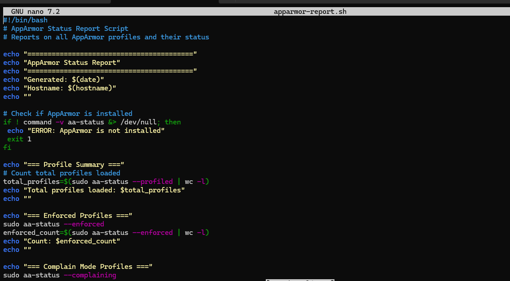
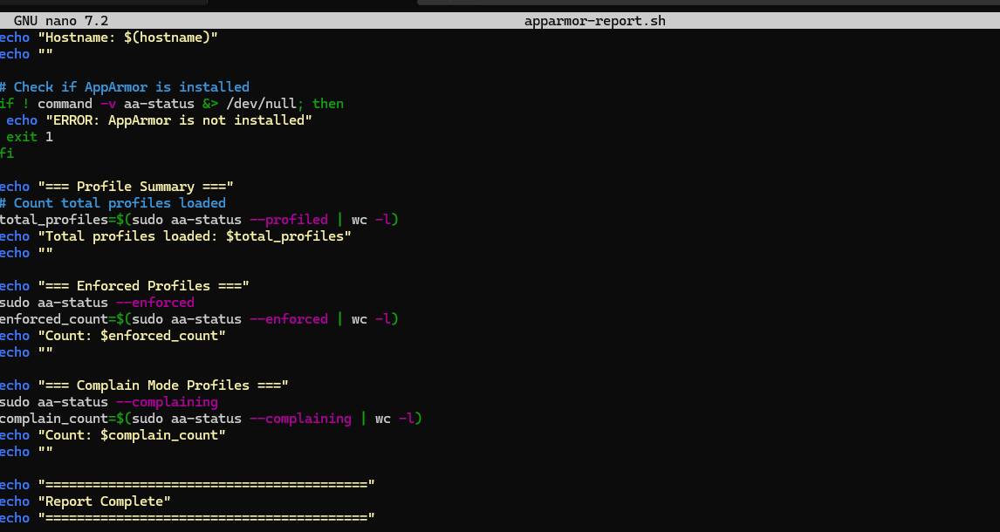

This script was created to summarise AppArmor status. The script confirms that AppArmor is installed, counts the loaded profiles, seperates enforced and complain modes and also produces a report like shown below.

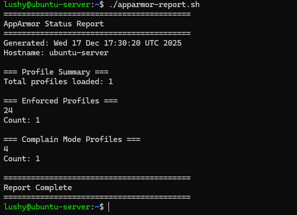

### MAC VS DAC
-**DAC** relies on user ownership and permissions.
-**MAC** enforces centrally defined security policies that cannot be override by users.

## Intrusion Detection with fail2ban

fail2ban was installed and configured for the purpose of protecting the SSH from brute force attacks by monitoring authentication logs and banned IP addresses.

## Monitoring fail2ban activity

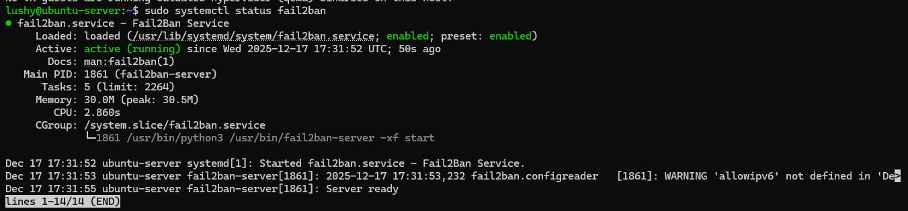

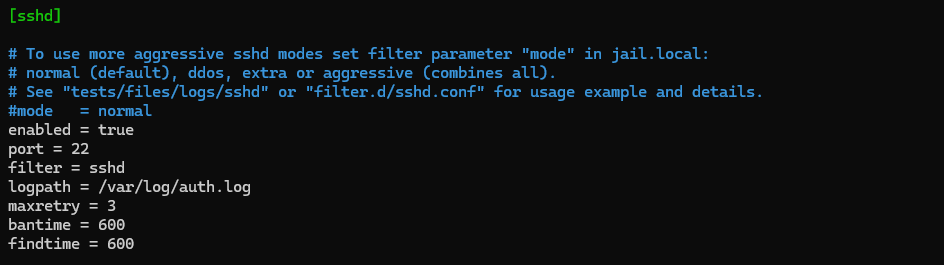

These confirm any active jails.

## Automatic Security Updates

Automatic security updates were enabled using the `unattended-upgrades` package. This ensure that all critical patches are applied, reducing and exposure to known vulnerabilities.

## Evidence Screenshot

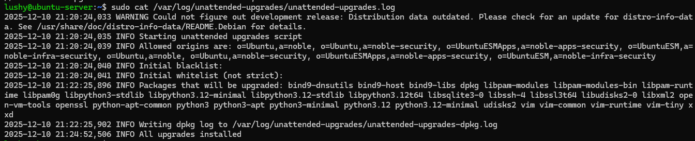

## Security Baseline Script

My comprehensive security baseline script is shown below:

## Security Script:

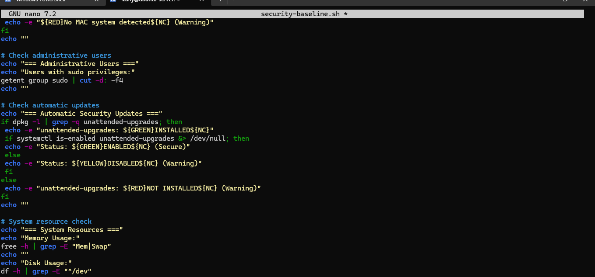
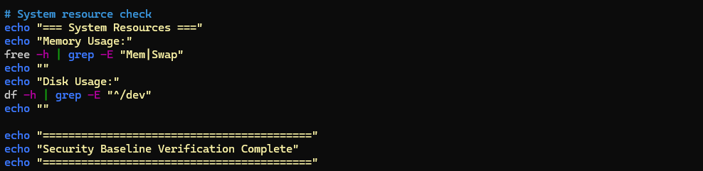

## The Execution:

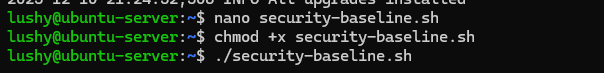

## The Report:

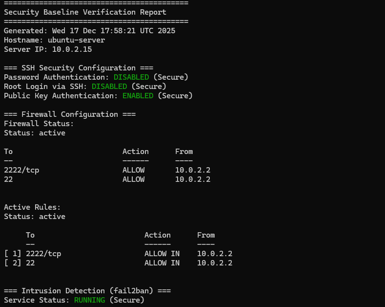
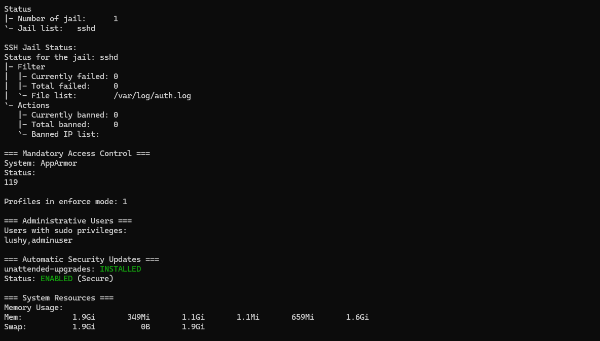
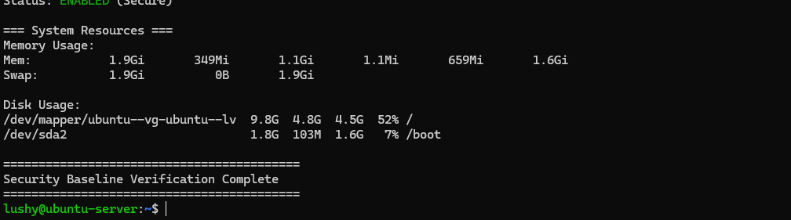

## Remote Monitoring Script

My remote monitoring script can be shown below:

## Monitoring Script

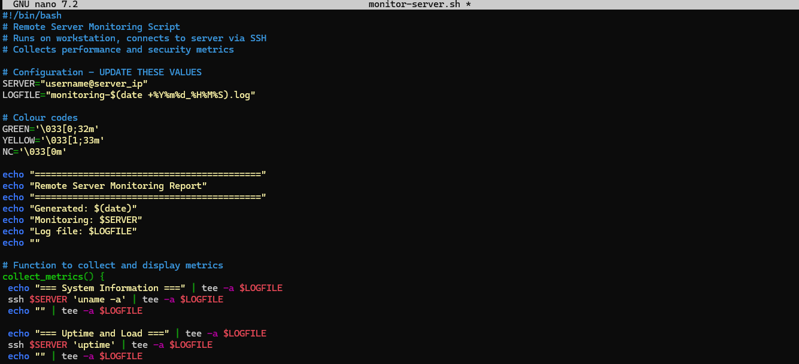
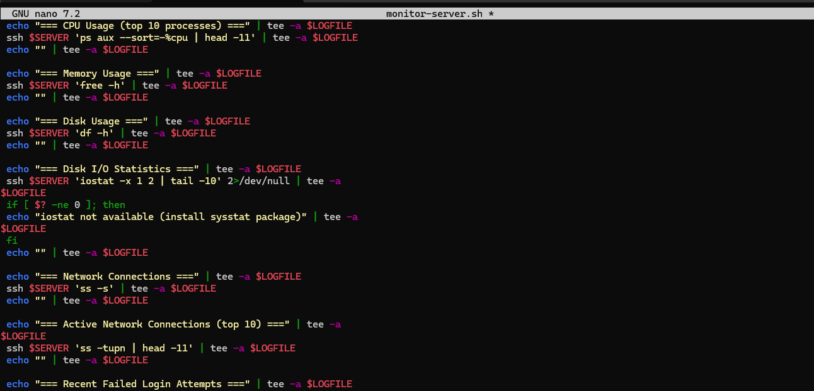

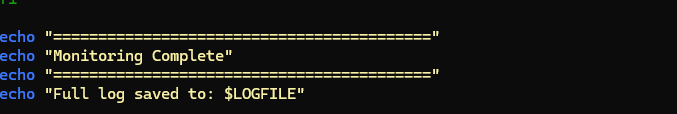

## Monitoring Report

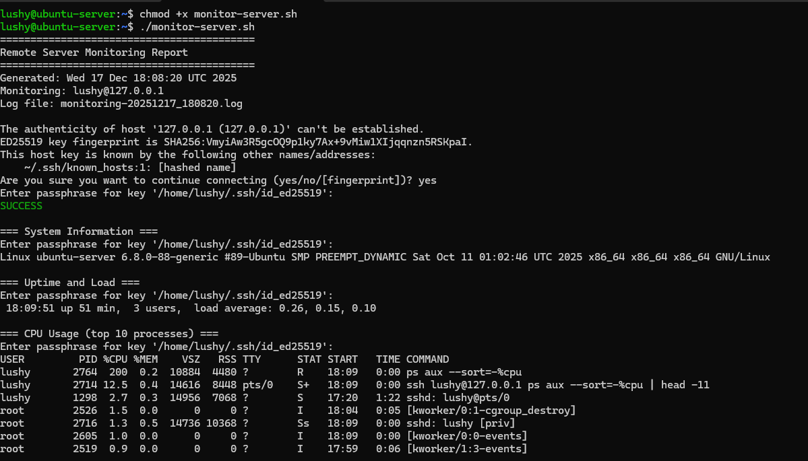

## Reflection
This week highlighted how layered the system's security is. My main challenge this week was understanding how specifc AppArmor rules translates into real system restrictions.
