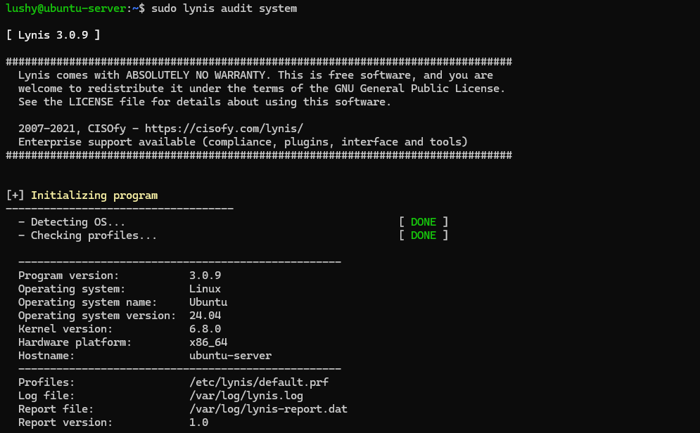

# Week 5 - Advanced Security and Monitoring Infrastructure

## Overview
This week focuses on conducting a security audit on the system and implementing hardening measures based on findings.
----

## Initial Security Audit
Lynis was installed and executed on the server to perform a full security audit:

The audit examined system configuration, authentication mechanisms, file permissions, kernel parameters and installed services. The final hardening index `59` was recorded as a baseline for comparison.

Hardening index : 59
Total tests performed: 256
Warnings: 1
Suggestions: 48

**Network Security Assessment**
Port Scanning with nmap - The scan results confirmed that only port 22 was open, which validates the effectiveness of firewall rules. All other ports were blocked reducing the attack surface.

**Firewall Effectiveness Verification**
Firewall was verified using:

**Commands used**
sudo ufw status numbered
sudo ufw status verbose
sudo iptables -L -n -v

Attempting to connect to ports such as Telnet failed as expected, confirming the firewall was enforced properly.

## Firewall Rules

Rule      |Port    |Action    |Source    |Justifications
------------------------------------------------------------------------------------------
1         |22      |ALLOW     |10.0.2.2  |Secure SSH access restricted to trusted management host 
2         |2222    |ALLOW     |10.0.2.2  |Alternative SSH port allowed for administrative access
Default   |All     |DENY      |Any       |Blocks all unauthorised inbound connections

**Service Inventory and Analysis**
Running and listening services were identified using:
sudo ss -tulnp
sytemctl list-units --type=service --state=running

Each service was assessed to determine necessity and security. No unnecessary services were identified at this stage, reducing the system's attack surface.

## Security Hardening Implementation

**Kernel Hardening**
Kernel parameters were hardened by modifying /etc/sysctl.conf making these changes:
net.ipv4.ip_forward = 0
net.ipv6.conf.all.forwarding = 0
net.ipv4.tcp_syncookies = 1
net.ipv4.conf.all.accept_redirects = 0
net.ipv4.conf.default.accept_redirects = 0
net.ipv6.conf.all.accept_redirects = 0
net.ipv6.conf.default.accept_redirects = 0
net.ipv4.conf.all.accept_source_route = 0
net.ipv4.conf.default.accept_source_route = 0
net.ipv6.conf.all.accept_source_route = 0
net.ipv6.conf.default.accept_source_route = 0

These changes protect against network-based attacks such as IP spoofing.

**File System Security**
File system was enhanced by securing shared memory with noexec, nodev, and nosuid. This reduces the risk of priviledge escalation and malicious code execution.

**Password and Authentication Hardening**
Password policies were strengthened to require a  minimum length of 12 characters, uppercase, lowercase, numeric and special characters, password expires every 90 days and account locks afte repeated login attempts.

## Post-Hardening Assessment:
**Re-running Lynis**
After implementing hardening measures, Lynis was exceuted again. I placed the results in a table below comparing them to the base results.

          |Index    |Tests performed  |Suggestions|Warning|
----------------------------------------------------------
Initial   |59       |256              |48         |1      |
Hardening |62       |259              |45         |2      |

## Reflection
One challenged I faced this week was during firewall verification, an intial attempt to execute sudo commands through a non-interactive SSH session failed. This highlighted the requirement for a TTY when using sudo. Which also showed the importance of understanding priviledge escalations.
