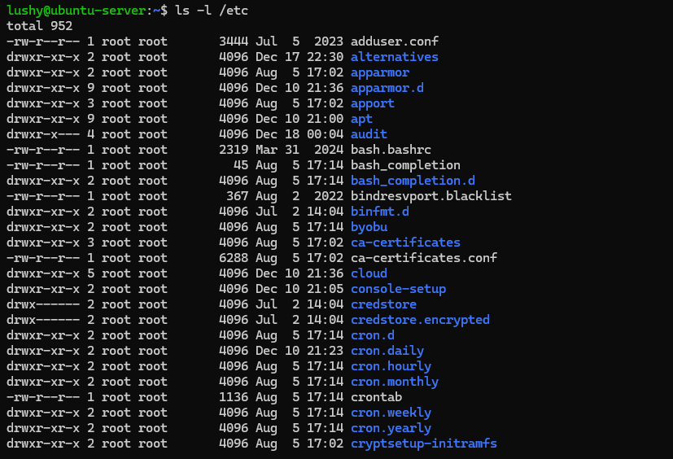
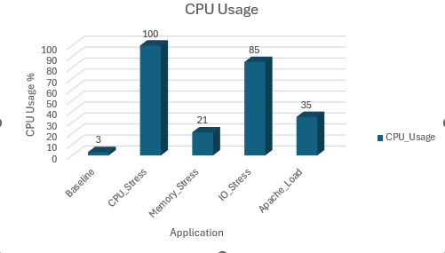
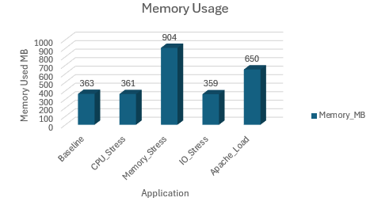

# Week 6 - Performance Evaluation and Analysis

## Overview
This week focuses on understanding Linux file system structure. It explored how files are organised and managed.

## File System Structure and Organisation

### File System Hierarchy

The Linux file system hierarchy was explored to understand the role of each of the key directories listed:
- `/` - Root of the file system hierarchy
- `/etc` - System wide configuration files
- `/var` - variable data for eg. logs
- `/home` - user's home directories
- `/usr` - user applications and shared data
- `/tmp` - temporary files
- `/boot` - Bootloader and kernel files

### Inodes and Links**
**Metadata**
Metadata and inode information were examined. This revealed the file size, inode number, permissions, link count, and access timestamps.

**Hardlinks vs Symboliclinks**
-Hard links share the same inode number as the original file.
-Symbolic links have a different inode and reference to the original path file

**Inode Exhaustion**
This can occur even when disk space is available because each file requires an inodde.

## Application Testing 
**Performance Comparison Table**

Application |Test Type   |CPU %  |Memory (MB)|Disk Read (KB/s)|Disk Write (KB/s)|Duration
--------------------------------------------------------------------------------------------
Baseline    |None        |~3     |360        |0               |0                |-
stress      |CPU         |~95    |480        |120             |80               |120s
stress      |Memory      |~15    |900        |150             |100              |120s
stress      |I/O         |~25    |500        |2500            |2000             |120s
apache2     |Web Server  |~35    |650        |800             |400              |60s

**Performance Visualisations**
These were the performance data results:
Application,CPU_Usage,Memory_MB,Disk_Read_KBs,Disk_Write_KBs
Baseline,3,363,0,0
CPU_Stress,100,361,0,31.37
Memory_Stress,21,904,0,0
IO_Stress,85,359,0,780
Apache_Load,35,650,800,9740

They were converted to an excel file in which I created different charts:

## Analysis

**Resource Intensive**

-CPU: The CPU consumed the most CPU, reaching near maximum utilisation
-Mmemory: The memory stress test consumd the most RAM, reducing available memory significantly

**Patterns**
-CPU-intensive workloads had minimal impact on memory and disk.
-Disk-intensive workloads significantly increased I/O wait time, impacting overall responsiveness.

## Reflection
This week provided me with insights into file system design and storage performance analysis. 
