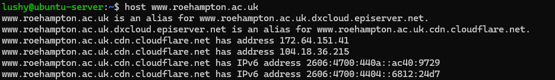
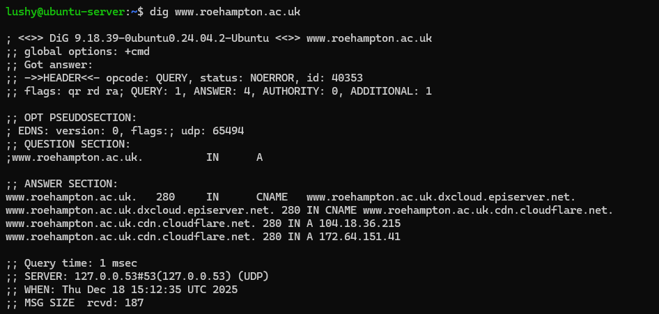

# Week 7 - Security Audit and System Evaluation

## Overview
This week focused on analysing network configuration, and performance within the environment.
---

### Network Configuration

Network interfaces were identified and analysed using:
ip addr show
ip -s link show

These commands showed the interface names, IPv4 and IPv6, as well as the MAC addresses and also the interface states.

### Evidence Screenshot

**Routing**
Routing information was examined using:
ip route show
route -n

The default gateway and network routes were identified, confirming correct routine between the workstation and the server. This ensures that outbound traffic is routed correctly and that return paths were available.

**DNS**
DNS was tsted using host and dig. 

### Evidence Screenshot

Results:
-Domain resolves via Cloudflare CDN
IPv4 and IPv6 addresses returned

**Active Connections and Service**
Active network services were identified using:
ss -tuln

Port|Protocol |Service |Purpose
22  |TCP      |SSH     |Remote administration
80  |TCP      |Apache  |Web server (used temporarily for testing)

Port 80 was removed after testing to restore firewall security

### Network Security
**Throughput Testing (iperf3)**

Test type|Throughput (Mbits/sec)|Notes 
Download |9.12                  |Stable
Upload   |8.54                  |Stable
Parallel |12.8                  |Improved
UDP      |97.6                  |No packet loss observed

### Application Network Performance
***SCP**

Test        |Speed
iperf3 TCP  |9-12 Gbps
SCP Upload  |12 MB/s
SCP Download|11 MB/s

SCP is slower due to encryption unlike iperf3 whhich tests raw network throughput

### Performance Summary
**Combined Performance Table**

Application  |CPU %|Memory (MB)|Disk Read (KB/s)|Disk Write (KB/s)|Network  |Bottleneck
Baseline     |3    |363        |0               |0                |Low      |None
CPU Stress   |100  |361        |31              |31               |Low      |CPU
Memory Stress|21   |904        |0               |0                |Low      |Memory
IO Stress    |85   |359        |780             |780              |Medium   |Disk
Apache Load  |35   |650        |9740            |9740             |High     |Network

### Analysis

***Most constrained resources**
-Network during Apache and SCP
-CPU during heavy encryption SCP transfers
-Disk I/O during Apach responses

**Tradeoffs**
-Encryption reduces raw network performance
-Parallel stream improve utilization

### Conclusion
The system demonstrates strong and stable network performance under varying workloads. Raw throughput is high whike real world applications reflect expected overheads.
