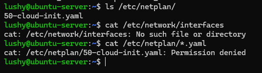

# Week 7 - Security Audit and System Evaluation

## Overview
This week focused on analysing network configuration, and performance within the environment.
---

### Network Configuration

Network interfaces were identified and analysed using:
ip addr show
ip -s link show

These commands showed the interface names, IPv4 and IPv6, as well as the MAC addresses and also the interface states.

##Evidence Screenshot

**Routing**
Routing information was examined using:
ip route show
route -n

The default gateway and network routes were identified, confirming correct routine between the workstation and the server. This ensures that outbound traffic is routed correctly and that return paths were available.

